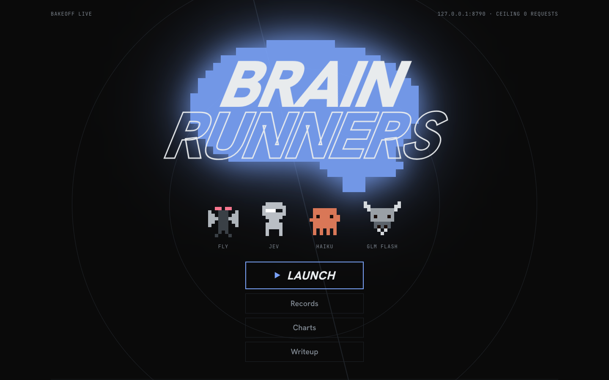

# Brain Runners

Very different kinds of mind run the same seeded tunnels, and a study asks which one runs furthest for what it
costs and for how long it thinks:

- **Jev**, TypeSafe's System One model, which answers with typed probabilities instead of text;
- **Claude Haiku 4.5**, a chat model, asked exactly the same questions;
- **an untrained fruit fly**: the adult *Drosophila* connectome as a spiking simulation. Gaps ahead stimulate its
  looming-sensitive visual neurons and its descending neurons steer. No training, only innate wiring;
- **three bots** for scale: a solver, a coin and one that always jumps.

Every mind gets the same six rows ahead and three lanes either side, and each row it stays, moves left or right,
or jumps. Watch them run side by side in the browser, with what each one had in mind: Jev's answers, Claude
Haiku's, the fly's neurons firing.

## What the study found

On 100 held-out tracks (15 for Claude Haiku) that no mind was tuned on. Full write-up: `docs/WRITEUP.html` (or the
Writeup screen), numbers in `docs/COSTS.md`.

| mind | mean rows (of 150) | seconds per decision | cost per track |
|---|---|---|---|
| solver (bot) | 149.2 | – | free |
| Jev, step 2 questions | 139.1 | 0.11 | ≈ $0.004 (estimate) |
| Jev, step 1 questions | 116.7 | 0.10 | ≈ $0.003 (estimate) |
| Claude Haiku, step 1 | 106.8 | 0.88 | $0.11 |
| Claude Haiku, step 2 | 100.2 | 1.02 | $0.16 |
| fly2 (fly, sideways input) | 76.2 | 0.69 | free |
| fly | 65.0 | 0.67 | free |
| random (bot) | 22.4 | – | free |

- **How the minds are asked matters most.** The same Jev runs 25 rows asked only "which move?" and 139 asked eight
  pointed questions two moves ahead.
- **On the same questions, Jev ran further than Claude Haiku** on three of the four question sets, answered about
  eight times faster, and costs a fraction as much. Claude Haiku was ahead only with the single "which move?"
  question. These comparisons rest on 15 tracks.
- **The untrained fly beats chance by a wide margin** with no training at all. It is slow because it is simulated
  on a laptop.

Every question, every rule that turns answers into a move, and how a gap becomes input to the fly's eye are ours,
not TypeSafe's, Anthropic's or the fly's. The write-up lists them.

## Run it yourself

    uv sync                                          # Python 3.13, https://docs.astral.sh/uv/
    uv run brain-runners                             # opens Brain Runners in your browser

The first time, it downloads the study's recorded runs (7 MB, free), so Brain Runners opens with the study loaded:
Records, Charts, the Writeup and every recorded run to watch again. Playing a new run with the bots is free. For
the other minds:

- **Jev and Claude Haiku** use your own API keys, in a `.env` file. Every paid mind has a hard cap on requests,
  and the page shows the worst case and asks before it spends.
- **The flies** need the fly model and data (about 400 MB) and about 1 GB of memory.

Step by step, with what each key costs: [`docs/SETUP.md`](docs/SETUP.md).

## Docs

| | |
|---|---|
| [`docs/SETUP.md`](docs/SETUP.md) | Installing it, your own keys, and how spending is kept in your hands. |
| [`docs/WALKTHROUGH.md`](docs/WALKTHROUGH.md) | Every command and every part of the page, and what each costs. |
| [`docs/EXPLAINER.html`](docs/EXPLAINER.html) | The whole project in plain language, then the technical detail. |
| [`docs/WRITEUP.html`](docs/WRITEUP.html), [`docs/COSTS.md`](docs/COSTS.md) | The study's write-up, and every paid run with what it cost. |
| [`docs/DECISIONS.md`](docs/DECISIONS.md) | Every decision, numbered; the code and the write-up cite them. |
| [`docs/FORMATS.md`](docs/FORMATS.md) | What a run leaves on disk, and the replay data the page draws. |
| [`docs/RESEARCH.md`](docs/RESEARCH.md), `docs/research/` | The fly-brain resources and deeper research, kept as written (its paths still say `calibration/` at the top, from before it moved under `docs/`). |
| `docs/calibration/`, `docs/spikes/` | How the flies were fixed and frozen, and the five probes' reports. Their throwaway code stayed on local branches: where the record says a report is "on branch `spike/…`", read `docs/spikes/`. |
| [`docs/history/`](docs/history/README.md) | How it was built: every spec, plan and mock-up, and the running notes. |

The fly model is Shiu et al.'s ([philshiu/Drosophila_brain_model](https://github.com/philshiu/Drosophila_brain_model)),
with FlyWire's annotations ([flyconnectome/flywire_annotations](https://github.com/flyconnectome/flywire_annotations)).
Both are downloaded from their authors under their own terms. The code here is MIT-licensed (`LICENSE`).
